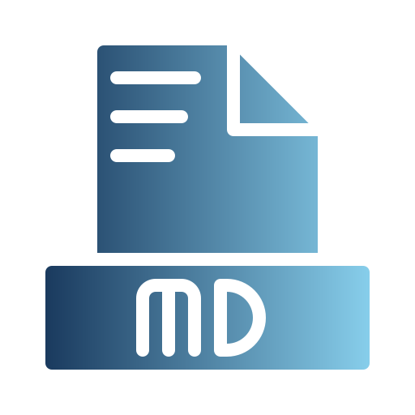

<p align="center">
  
</p>

<h1 align="center">mdreader</h1>

<p align="center">
  A fast, lightweight desktop markdown and MDX viewer built with Rust and egui.
</p>

<p align="center">
  <a href="#features">Features</a> &middot;
  <a href="#installation">Installation</a> &middot;
  <a href="#usage">Usage</a> &middot;
  <a href="#license">License</a>
</p>

---

## Features

- **Fast Rendering** — Immediate mode GUI with egui for smooth performance
- **CLI Support** — Open files from command line: `mdreader file.md`
- **File Picker** — GUI file dialog when no CLI argument provided
- **Full Markdown Support** — Headers, lists, code blocks, links, tables, blockquotes
- **MDX Support** — Opens `.mdx` files, stripping import/export statements for clean rendering
- **Syntax Highlighting** — Code blocks with language detection
- **Clickable Links** — External URLs open in browser, internal links navigate
- **Search** — `Ctrl+F` to search within document with match highlighting
- **Themes** — Dark/light mode toggle
- **Auto-Reload** — Watches files and reloads on external changes
- **Navigation History** — Back/forward buttons for internal links
- **Status Bar** — Shows filename, line count, character count

## Installation

### From releases

Download the latest binary for your platform from the [Releases](https://github.com/dcristob/mdreader/releases) page.

### Arch Linux

```bash
makepkg -si
```

A `PKGBUILD` is included in the repository for building and installing natively on Arch.

### From source

```bash
cargo build --release
```

The binary will be at `./target/release/mdreader`.

### Linux desktop integration

To install system-wide with desktop entry (open `.md` and `.mdx` files by double-click):

```bash
cp target/release/mdreader ~/.local/bin/mdreader
cp mdreader.desktop ~/.local/share/applications/mdreader.desktop
```

## Usage

```bash
# Open a markdown file
mdreader document.md

# Open an MDX file
mdreader page.mdx

# Open without file (shows file picker)
mdreader
```

## Keyboard Shortcuts

| Shortcut | Action |
|----------|--------|
| `Ctrl+F` | Toggle search bar |
| `Ctrl+O` | Open file |

## Tech Stack

- **Rust**
- **egui + eframe** — Immediate mode GUI
- **pulldown-cmark** — Markdown parsing
- **syntect** — Syntax highlighting
- **egui_commonmark** — Markdown rendering
- **notify** — File watching
- **rfd** — File dialogs

## License

[MIT](LICENSE.md)
